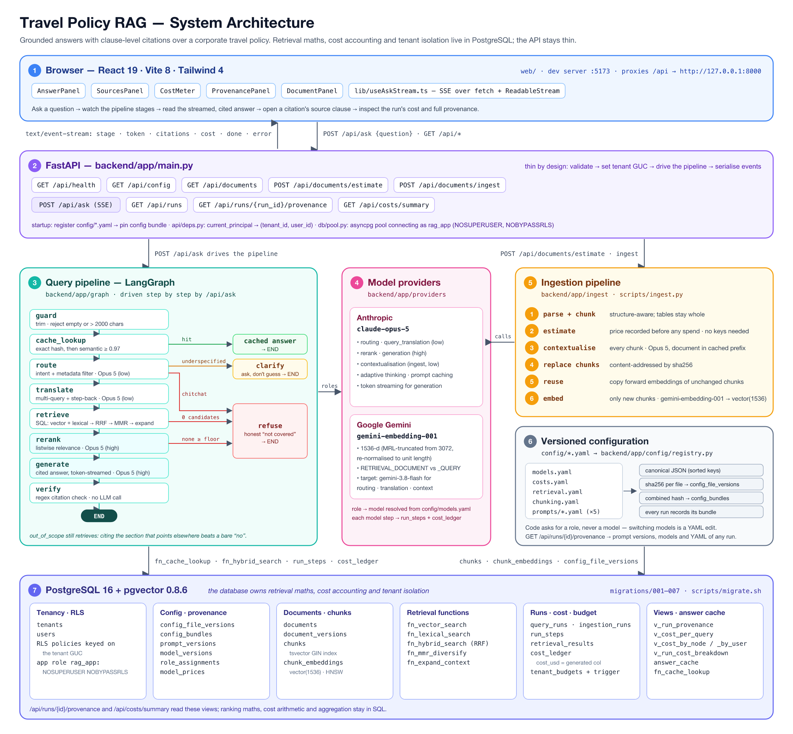
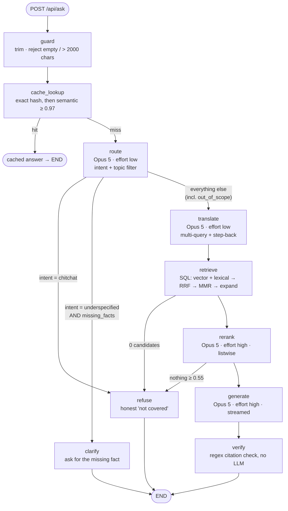
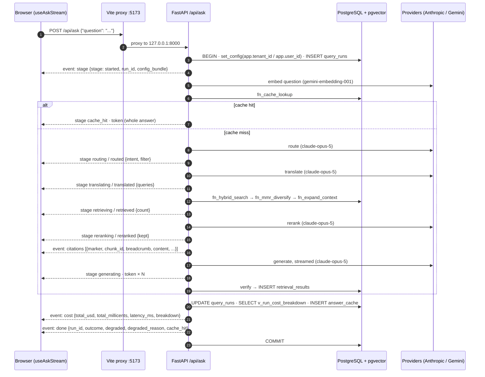
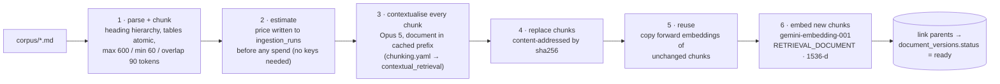
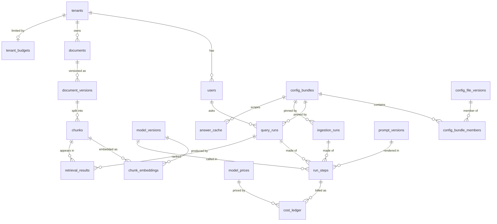

# Travel Policy RAG

Ask a question about a corporate travel policy and get a grounded answer, with citations back to the exact clause. If the policy doesn't cover the question, it says so instead of guessing.

> *"What's the per diem in Tokyo?"* → an answer quoting §7.2 of the policy, with a clickable `[1]` citation, a per-node cost breakdown, and a full provenance record of which prompts, models and config versions produced it.

The backend is Python with **FastAPI + LangGraph**, the UI is **React + Vite**, and the database is **PostgreSQL 16 + pgvector**. The database owns the retrieval maths, the cost accounting and the tenant isolation instead of leaving them to application code.



<sub>Diagram source: [`docs/images/architecture.svg`](docs/images/architecture.svg) (vector) · regenerate with [`docs/diagrams/architecture.py`](docs/diagrams/architecture.py)</sub>

---

## Contents

- [Quick start](#quick-start)
- [What it does](#what-it-does)
- [Tech stack](#tech-stack)
- [Architecture](#architecture)
  - [The seven layers](#the-seven-layers)
  - [Query pipeline](#query-pipeline)
  - [Life of one question](#life-of-one-question)
  - [Ingestion pipeline](#ingestion-pipeline)
  - [Data model](#data-model)
- [Repository layout](#repository-layout)
- [Getting started (step by step)](#getting-started-step-by-step)
- [Running without `make`](#running-without-make)
- [Degraded mode (no API keys)](#degraded-mode-no-api-keys)
- [Using the web UI](#using-the-web-ui)
- [API reference](#api-reference)
- [Configuration](#configuration)
- [Database and migrations](#database-and-migrations)
- [Cost tracking](#cost-tracking)
- [Testing](#testing)
- [Evaluation](#evaluation)
- [Makefile reference](#makefile-reference)
- [Design decisions](#design-decisions)
- [Things worth knowing](#things-worth-knowing)
- [Known limitations](#known-limitations)
- [Troubleshooting](#troubleshooting)
- [Scaling past one user and one document](#scaling-past-one-user-and-one-document)

---

## Quick start

On macOS with Homebrew, from a fresh clone (one-time prerequisites, including pgvector for PostgreSQL 16, are in [Prerequisites](#prerequisites)):

```bash
cp .env.example .env                               # then add your API keys (optional, see below)

make setup      # Python 3.14 venv (uv) + backend deps + frontend deps (pnpm)
make db-up      # start Postgres 16
make db-reset   # DROP + CREATE the travel_rag database, apply migrations 001–007
make seed       # default tenant/user, budgets, register the YAML config bundle
make estimate   # price ingesting the corpus (spends nothing, needs no API keys)
make dev        # API on http://127.0.0.1:8000, UI on http://localhost:5173
```

Then open **http://localhost:5173**, go to **Documents → Estimate cost → Ingest** (needs `ANTHROPIC_API_KEY` + `GEMINI_API_KEY`, about $0.68), and ask a question.

`make estimate` works with no credentials at all, and that's deliberate: you want to know what ingesting a document will cost *before* you pay for it. Everything up to and including `make estimate` needs no API keys. See [Getting started](#getting-started-step-by-step) for each step explained, Linux notes, and what to do without keys.

---

## What it does

- **Grounded Q&A with citations.** Answers are generated only from retrieved policy excerpts, and every sentence is expected to carry a `[n]` marker that points at a real retrieved chunk. The UI turns markers into buttons that scroll to the source passage.
- **Honest refusals and clarifications.** If retrieval or reranking finds nothing relevant enough, the system refuses (*"the policy does not appear to address this"*) instead of generating. If the question is missing a fact the answer depends on (grade band, flight duration), it asks rather than guessing.
- **Hybrid retrieval in SQL.** Vector search (pgvector HNSW) and lexical search (PostgreSQL full-text) are fused with Reciprocal Rank Fusion, diversified with MMR and expanded to whole sections. All of it runs as SQL functions.
- **Structure-aware chunking.** Markdown is chunked along its heading hierarchy. Tables are never split mid-row, and a table too large for one chunk is split by row with the header repeated.
- **Contextual retrieval.** At ingestion time each chunk gets a one-sentence situating summary from Claude Opus 5, with the whole document held in a cached prompt prefix.
- **Cost measured per step.** Every pipeline step that calls a model writes a `run_steps` row and a `cost_ledger` row with its token counts *and* the unit prices in force at the time. Budgets are enforced by a database trigger, and ingestion is priced before any money is spent.
- **Provenance for every answer.** Each run records which config bundle (the hashed YAML), prompt versions and model versions produced it, and `GET /api/runs/{id}/provenance` reconstructs that record from the database alone.
- **Multi-tenant from day one.** Row-level security on every tenant table, enforced by PostgreSQL, with the app connecting as a non-superuser role.
- **Streaming UI.** Stage progress, citations and answer tokens stream to the browser over Server-Sent Events.

---

## Tech stack

| Layer | Technology |
|---|---|
| Frontend | React 19, Vite 8, Tailwind CSS 4, TypeScript 6 (`web/`) |
| API | FastAPI 0.141, Uvicorn, SSE over `StreamingResponse` (`backend/app/main.py`) |
| Orchestration | LangGraph 1.2 (`StateGraph` in `backend/app/graph/build.py`) |
| Chat model | Claude Opus 5 (`claude-opus-5`), used for routing, query translation, rerank, generation and contextualisation |
| Embeddings | Gemini `gemini-embedding-001`, truncated to 1536 dims (Matryoshka) and re-normalised |
| Database | PostgreSQL 16 + pgvector 0.8 (HNSW), `pg_trgm`, `pgcrypto` |
| DB driver | asyncpg (pool), psql for migrations |
| Python tooling | Python 3.14, `uv`, pytest |
| JS tooling | Node ≥ 20.19 / 22.12, pnpm ≥ 9, oxlint |

All Python dependencies are pinned in [`requirements.txt`](requirements.txt). JavaScript dependencies are locked in [`web/pnpm-lock.yaml`](web/pnpm-lock.yaml).

---

## Architecture

### The seven layers

The numbers match the numbered boxes in the diagram above.

| # | Layer | Where | Responsibility |
|---|---|---|---|
| 1 | **Browser** | `web/` | Ask box, streamed answer with clickable citations, Sources / Provenance / Documents tabs, cost meter. The Vite dev server on `:5173` proxies `/api` to `127.0.0.1:8000`. |
| 2 | **FastAPI** | `backend/app/main.py` | 9 endpoints. Thin by design: validate, open a transaction, set the tenant GUCs, drive the pipeline, serialise SSE events. At startup it registers the YAML config and pins a *config bundle* for the life of the process. |
| 3 | **Query pipeline** | `backend/app/graph/` | guard → cache_lookup → route → translate → retrieve → rerank → generate → verify, with early exits to `refuse` / `clarify` / cached answer. |
| 4 | **Model providers** | `backend/app/providers/` | Anthropic and Gemini behind one interface and one `Usage` shape. Call sites ask for a **role** (`"rerank"`), and `config/models.yaml` resolves it to a model. |
| 5 | **Ingestion pipeline** | `backend/app/ingest/`, `scripts/ingest.py` | parse + chunk → estimate → contextualise → store chunks → reuse unchanged embeddings → embed new chunks. |
| 6 | **Versioned configuration** | `config/`, `backend/app/config/registry.py` | 9 YAML files are canonicalised and hashed into a bundle, and every run records which bundle it used. |
| 7 | **PostgreSQL + pgvector** | `migrations/001–007` | 22 tables, 8 views, 11 `fn_*` functions, 14 RLS policies: hybrid retrieval, the cost ledger and budget trigger, provenance views and the answer cache. |

What stays in Python is the LLM calls, the pipeline's control flow and HTTP. Ranking arithmetic, cost arithmetic, tenant filtering and reporting aggregations live in SQL. [`tests/test_api_thinness.py`](tests/test_api_thinness.py) fails the build if they leak back into a route handler.

### Query pipeline



| Node | Model role → model today | What it does | Writes `run_steps` / `cost_ledger` |
|---|---|---|---|
| `guard` | none | Strips the question; rejects empty or > 2000 characters. | no |
| `cache_lookup` | `embedding` → gemini-embedding-001 | Embeds the question once, then calls `fn_cache_lookup`: an exact hit on the normalised question hash, else a semantic hit at cosine ≥ **0.97** within the same config bundle and document version. | no |
| `route` | `routing` → claude-opus-5 (low) | Classifies intent (`policy_lookup`, `calculation`, `comparison`, `out_of_scope`, `underspecified`, `chitchat`), lists missing facts, and picks a topic filter when exactly one topic applies. | step 1 |
| `translate` | `query_translation` → claude-opus-5 (low) | Rewrites the question into policy vocabulary, with a step-back ("broader") query and sub-questions. At most `max_queries + 2` queries per intent. HyDE was deliberately rejected. | step 2 |
| `retrieve` | `embedding` → gemini-embedding-001 | Embeds the extra queries (reusing the cached question vector), runs `fn_hybrid_search` per query, merges, then `fn_mmr_diversify` (λ 0.7 → 20) and `fn_expand_context` (≤ 1200 tokens per section). | step 3 |
| `rerank` | `rerank` → claude-opus-5 (high) | Listwise relevance scoring of the top 20; keeps up to 6 with score ≥ `min_rerank_relevance` (**0.55**). | step 4 |
| `generate` | `generation` → claude-opus-5 (high) | Writes the answer from the kept excerpts with `[n]` markers, streamed token by token. | step 5 |
| `verify` | none | Regex `\[(\d+)\]`: every marker must point at a retrieved excerpt, and at least 60% of sentences must carry one. A failure marks the answer `degraded`. It also records `retrieval_results`. | no |
| `refuse` / `clarify` | none | Fixed-text refusal (`refused_out_of_scope` for chitchat, else `refused_no_evidence`) or a clarification listing the missing facts (`needs_clarification`). | no |

> **How LangGraph is used.** `backend/app/graph/build.py` declares the pipeline as a LangGraph `StateGraph` with the routing functions above. The live `/api/ask` handler (`_drive` in `main.py`) calls the same node methods one after another and reuses `route_after_routing`. It does this so that SSE stage events and generation tokens can go out interleaved on one stream, which `compiled.astream` would not allow. Generation is streamed inline through `provider.stream`, and the graph's `generate` node is the non-streaming equivalent.

> **Out-of-scope questions still retrieve.** Only `chitchat` (and `underspecified` with missing facts) short-circuits after routing. An `out_of_scope` question goes through retrieval on purpose, because citing the section that points the user at the right policy (§1.3 lists what is governed elsewhere) is more useful than a bare "not covered".

### Life of one question



Every model call made through the instrumented steps writes one `run_steps` row plus one `cost_ledger` row (tokens × frozen unit prices). A database trigger rolls the cost up into `query_runs.total_cost_usd`, and the final `cost` event reads it back from the `v_run_cost_breakdown` view.

### Ingestion pipeline



Steps 1–2 are `Ingestor.prepare()`: no API keys, no spend, and an `ingestion_runs` row with the estimate is written first. Steps 3–6 are `Ingestor.run()`, where the money is spent. The corpus ([`corpus/travel-policy-v1.md`](corpus/travel-policy-v1.md), 14 sections, ~3,500 words, 10 tables) produces **71 chunks**. There are two entry points: the **Documents** tab in the UI (`POST /api/documents/estimate` and `/ingest`), and the CLI (`make estimate` / `make ingest`; see [Known limitations](#known-limitations) for the CLI ingest bug). Documents are referenced by a path inside the repository; there is no file upload.

### Data model



| Group | Tables | Migration |
|---|---|---|
| Tenancy | `tenants`, `users` | 001 |
| Config & provenance | `config_file_versions`, `config_bundles`, `prompt_versions` (append-only, enforced by trigger), `config_bundle_members`, `model_versions`, `role_assignments`, `model_prices` | 002 |
| Documents | `documents`, `document_versions`, `chunks` (tsvector GIN + trigram), `chunk_embeddings` (`vector(1536)`, HNSW) | 003 |
| Runs & cost | `ingestion_runs`, `conversations`, `query_runs`, `run_steps`, `retrieval_results`, `cost_ledger`, `tenant_budgets` | 005 |
| Cache | `answer_cache` | 006 |
| Migration ledger | `schema_migrations` (created by `scripts/migrate.sh`) | — |

---

## Repository layout

```
.
├── backend/app/
│   ├── main.py                 FastAPI app: 9 endpoints, SSE driver, no business logic
│   ├── api/deps.py             current_principal → (tenant_id, user_id); the seam for real auth
│   ├── core/settings.py        .env settings: DB URL, API keys, tenant defaults (nothing behavioural)
│   ├── db/pool.py              asyncpg pool; tenant_tx() sets app.tenant_id / app.user_id per transaction
│   ├── config/registry.py      load YAML → canonical JSON → sha256 → config bundle
│   ├── providers/              base.py (interface + Usage), anthropic_provider.py, gemini_provider.py
│   ├── ingest/                 chunker.py (structure-aware), estimator.py (price before spending), pipeline.py
│   └── graph/                  build.py (StateGraph), nodes.py, state.py, resolver.py (role → model), instrument.py (run_steps + cost_ledger)
├── config/                     Versioned YAML: the only place models, prompts, thresholds and prices live
│   ├── models.yaml             Model catalogue + role → model assignment (the Gemini switch)
│   ├── costs.yaml              Effective-dated price book, estimation assumptions, budgets
│   ├── retrieval.yaml          Index params, RRF weights, MMR, thresholds, cache, citation guards
│   ├── chunking.yaml           Chunk sizes, contextual retrieval toggle
│   ├── prompts/*.yaml          contextualisation, generation, query_translation, rerank, routing
│   └── README.md               How config versions are recorded; provenance SQL
├── migrations/                 Plain numbered SQL, applied in order by scripts/migrate.sh
│   ├── 001_extensions_and_tenancy.sql   pgvector/pg_trgm/pgcrypto, rag_app role, RLS helpers, tenants/users
│   ├── 002_config_provenance.sql        Config/prompt/model/price registries (append-only triggers)
│   ├── 003_documents_and_chunks.sql     Documents, content-addressed chunks, embeddings + HNSW
│   ├── 004_retrieval_functions.sql      fn_vector_search, fn_lexical_search, fn_hybrid_search, fn_mmr_diversify, fn_expand_context
│   ├── 005_runs_and_cost.sql            Runs, steps, cost ledger (generated cost_usd), budget + rollup triggers
│   ├── 006_views_and_cache.sql          Provenance + cost views, two-tier answer cache
│   └── 007_run_cost_breakdown.sql       Per-run cost view used by the /ask stream
├── scripts/
│   ├── migrate.sh              Migration runner (sha256 ledger; --reset, --status)
│   ├── seed.py                 Default tenant/user, budgets, config registration
│   ├── ingest.py               CLI ingestion (--estimate-only spends nothing; --no-context)
│   ├── evaluate.py             30-question evaluation against the live API
│   └── verify_{rls,retrieval,cost}.sql   SQL assertion suites run by `make test`
├── tests/                      pytest: chunker, cost arithmetic, API-thinness (AST) checks
├── corpus/
│   ├── travel-policy-v1.md     Synthetic "Northwind Global" travel policy v4.2 (14 sections)
│   └── eval-set.yaml           30 questions across 9 categories with expected citations
├── web/                        React + Vite UI
│   ├── src/App.tsx             Layout + state; src/components/* panels
│   ├── src/lib/useAskStream.ts SSE over fetch + ReadableStream (EventSource can't POST)
│   ├── src/lib/types.ts        Hand-written wire types for the SSE + REST contract
│   └── vite.config.ts          :5173, proxies /api → 127.0.0.1:8000 with buffering off
├── docs/images/                Architecture diagram (SVG + PNG)
├── docs/diagrams/              Script that generates the architecture diagram
├── Makefile                    Every command you need (run `make help`)
├── requirements.txt            Pinned Python dependencies
└── .env.example                Template for .env (copy it; never commit .env)
```

---

## Getting started (step by step)

### Prerequisites

| Tool | Version | Why | Install (macOS) |
|---|---|---|---|
| PostgreSQL | **16** | Database; `UNIQUE NULLS NOT DISTINCT` needs PG ≥ 15 | `brew install postgresql@16` |
| pgvector | 0.8.x | `vector(1536)` + HNSW index | Build from source for PG 16 (below). Homebrew's `pgvector` package only ships builds for PostgreSQL 17 and 18. |
| uv | any recent | Creates the Python 3.14 venv and installs deps | `brew install uv` or `curl -LsSf https://astral.sh/uv/install.sh \| sh` |
| Python | 3.14 | Backend (uv downloads it if missing; 3.13 also passes the tests) | via uv |
| Node.js | ^20.19 or ≥ 22.12 | Vite 8 requirement | `brew install node` |
| pnpm | ≥ 9 | Frontend deps (lockfile v9) | `brew install pnpm` |
| API keys | optional | Live embedding and answering | [Anthropic](https://console.anthropic.com/) and [Google AI Studio](https://aistudio.google.com/apikey) |

```bash
brew install postgresql@16 uv pnpm node

# postgresql@16 is keg-only: put psql / pg_config on PATH (or: brew link --force postgresql@16)
echo 'export PATH="/opt/homebrew/opt/postgresql@16/bin:$PATH"' >> ~/.zshrc && source ~/.zshrc

# pgvector built against PostgreSQL 16
git clone --branch v0.8.6 --depth 1 https://github.com/pgvector/pgvector.git /tmp/pgvector
make -C /tmp/pgvector PG_CONFIG=/opt/homebrew/opt/postgresql@16/bin/pg_config
make -C /tmp/pgvector install PG_CONFIG=/opt/homebrew/opt/postgresql@16/bin/pg_config
```

### 1. Clone

```bash
git clone https://github.com/prajapatizeel240024/AdvanceRAG.git
cd AdvanceRAG
```

### 2. Create `.env`

```bash
cp .env.example .env
```

Then edit `.env`:

```dotenv
DATABASE_URL=postgresql://rag_app@localhost:5432/travel_rag   # keep the rag_app@ part (see below)
ANTHROPIC_API_KEY=sk-ant-...       # routing, translation, rerank, generation, contextualisation
GEMINI_API_KEY=...                 # embeddings
```

Both keys are optional for everything up to `make estimate`. Keep `rag_app@` in `DATABASE_URL`. Without it, the API connects as your OS user, which is a PostgreSQL **superuser** on a default Homebrew install. Superusers bypass row-level security, so tenant isolation would silently stop applying. `.env` is gitignored, so never commit it.

### 3. Install dependencies

```bash
make setup
```

This creates `.venv` with Python 3.14 (`uv venv --python 3.14 .venv`), installs `requirements.txt`, and runs `pnpm install` in `web/`. `uv venv` refuses to overwrite an existing `.venv`, so to re-run it use `UV_VENV_CLEAR=1 make setup` (or `rm -rf .venv` first).

### 4. Start PostgreSQL and build the schema

```bash
make db-up      # brew services start postgresql@16, then waits for pg_isready
make db-reset   # ⚠ DROP DATABASE travel_rag; CREATE; apply migrations 001–007
```

`make db-reset` is destructive. It is the right command on first setup. Afterwards, use `make migrate` to apply only new migrations and keep your data. The runner prints a schema summary when it finishes:

```
==> 7 applied, schema summary
  tables:    22
  views:     8
  functions: 11
  policies:  14
```

Migrations run through `psql` as **your OS user**, which must be a **superuser**: pgvector isn't a trusted extension, and migration 001 creates the `rag_app` role. On a default Homebrew install it is. `make migrate` expects the database to exist already, so on a fresh machine start with `make db-reset`. To use a different database name, run `DB_NAME=my_db ./scripts/migrate.sh --reset` and point `DATABASE_URL` at it.

### 5. Seed the tenant and register the config

```bash
make seed
```

This creates tenant `acme` and user `DEFAULT_USER_EMAIL` (default `user@example.com`), copies the budgets from `config/costs.yaml` into `tenant_budgets`, and registers the 9 YAML config files as a config bundle. Expected output:

```
tenant   acme  <uuid>
user     user@example.com  <uuid>
bundle   <16-hex-hash>  <uuid>
config   9 files registered
```

Without API keys it adds a `DEGRADED MODE: ... not set.` note. That is expected and harmless at this stage.

### 6. Price the ingestion (free)

```bash
make estimate
```

This chunks the corpus and prices contextualisation plus embedding without calling any API. With the default config it comes to **71 chunks and about $0.68**, almost all of it contextualisation (see [Cost tracking](#cost-tracking)). It also prints a warning that the thinking-token multiplier is an assumption.

### 7. Run it

```bash
make dev        # = make api (uvicorn :8000, --reload) + make web (Vite :5173) in parallel
```

- UI: **http://localhost:5173**
- API: **http://127.0.0.1:8000**. Interactive OpenAPI docs are at **http://127.0.0.1:8000/docs**.

### 8. Ingest the corpus

Ingestion needs `ANTHROPIC_API_KEY` (contextualisation) and `GEMINI_API_KEY` (embeddings) in `.env`. Restart the API after adding them. There are two ways to ingest.

**From the UI:** open the **Documents** tab, keep the path `corpus/travel-policy-v1.md`, press **Estimate cost**, then **Ingest**. The status pill turns green (`ready`).

**From the API:**

```bash
curl -s -X POST http://127.0.0.1:8000/api/documents/ingest \
  -H 'content-type: application/json' \
  -d '{"path":"corpus/travel-policy-v1.md","approve":true}'
# embeddings only (no Anthropic key, no contextual summaries): add "contextualise": false
```

`approve: true` is required because the ~$0.68 estimate is above the $0.25 auto-approve threshold. Anything above the $2.00 per-run cap is refused with HTTP 402.

> The CLI path (`make ingest`) currently fails when it stores the new embeddings, after the model calls have already been paid for. Use the UI or API until that's fixed; see [Known limitations](#known-limitations).

Then try one of the sample questions, or:

```bash
curl -N -X POST http://127.0.0.1:8000/api/ask \
  -H 'content-type: application/json' \
  -d '{"question":"What is the per diem in Tokyo?"}'
```

### 9. Check everything

```bash
make test       # 33 pytest tests + 3 SQL assertion suites (needs the seeded DB; other DB: make test DB=<name>)
make eval       # 30-question evaluation against the running API (needs both keys + ingested corpus; spends money)
```

### Linux notes

The Makefile targets `db-up` (Homebrew services) and `migrate.sh` (`shasum`) assume macOS. On Debian or Ubuntu:

```bash
sudo apt install postgresql-16 postgresql-16-pgvector
sudo systemctl start postgresql              # instead of `make db-up`
sudo -u postgres createuser -s "$USER"       # let your OS user run migrations (needs superuser)
```

`rag_app` is created without a password, and Homebrew's default `pg_hba.conf` trusts local connections. Many Linux packages require a password on `127.0.0.1` instead, so for local development add `host all rag_app 127.0.0.1/32 trust` to `pg_hba.conf` and reload Postgres. `migrate.sh` uses `shasum` (Perl); if it's missing, install the `perl` package that provides it. These steps are untested; the project was developed on macOS.

---

## Running without `make`

Every target is a thin wrapper. Run these from the repository root, because `CONFIG_DIR=config` is relative and `PYTHONPATH=backend` is required:

```bash
uv venv --python 3.14 .venv && VIRTUAL_ENV=.venv uv pip install -r requirements.txt
(cd web && pnpm install)

./scripts/migrate.sh --reset                                   # or: ./scripts/migrate.sh  /  --status
PYTHONPATH=backend .venv/bin/python scripts/seed.py
PYTHONPATH=backend .venv/bin/python scripts/ingest.py --estimate-only
PYTHONPATH=backend .venv/bin/python scripts/ingest.py          # --no-context, --path, --slug, --title, --version (see Known limitations)

PYTHONPATH=backend .venv/bin/uvicorn app.main:app --reload --host 127.0.0.1 --port 8000
(cd web && pnpm dev)                                           # second terminal
```

Frontend-only commands (inside `web/`):

```bash
pnpm dev            # http://localhost:5173, proxies /api → http://127.0.0.1:8000
pnpm build          # tsc -b && vite build → web/dist/
pnpm preview        # serve web/dist on :4173 (same /api proxy)
pnpm lint           # oxlint
pnpm exec tsc -b    # full type-check
```

FastAPI doesn't serve the built SPA. In production, serve `web/dist/` from a static server or reverse proxy that forwards `/api` to Uvicorn **with response buffering off**, or the SSE stream arrives all at once.

---

## Degraded mode (no API keys)

Without API keys the system still runs: migrations, seeding, config registration and provenance, parsing, structure-aware chunking and full ingestion cost estimation. Only live ingestion (contextualisation needs Anthropic, embedding needs Gemini) and live answering need credentials.

| What | Without keys |
|---|---|
| `make seed`, `make estimate`, `make test` | Work fully |
| `GET /api/health` | `{"ok": true, "degraded": true, "missing_keys": ["ANTHROPIC_API_KEY", "GEMINI_API_KEY"], ...}` (degraded if *either* key is missing) |
| UI | Header pill **"Degraded — no API keys"**; hover to see which keys are missing |
| `POST /api/documents/estimate` | Works |
| `POST /api/documents/ingest`, `make ingest` | HTTP 503 or exit code 3 naming the missing key; nothing is written |
| `POST /api/ask` | No document can reach `ready` without keys, so the stream sends `error: No document has been ingested yet.`. With a ready document and a missing key, it sends an `error` event naming the key (exact-hash cache hits are still answered). |

Settings are cached per process, so **restart the API after editing `.env`**. `--reload` only watches Python files.

---

## Using the web UI

```
┌──────────────────────────────────────────────────────────────────────────────┐
│ [TP] Travel Policy Assistant                 [cfg 1a2b3c4d] [Degraded — …]   │
├──────────────────────────────────────────────────────────────────────────────┤
│ Ask about booking, cabin class, per diems, hotel caps, …                     │
│ [What is the per diem in Tokyo?] [I'm a Senior Engineer…] [...]      [Ask]   │
├───────────────────────────────────────────────┬──────────────────────────────┤
│ ANSWER                                        │ [Sources | Provenance | Docs]│
│  • Searching the policy                       │  Sources: cited passages,    │
│  The Tier 1 per diem is … [1] [2]             │   relevance bars, reasons    │
│  Answered · run 1a2b3c4d                      │  Provenance: active config + │
│ COST METER                                    │   per-step prompts/models    │
│  13.48 millicents · $0.000135 · 812 ms        │  Documents: estimate, ingest │
│  Node | Model | In | Cached | Out | Cost      │   and document versions      │
└───────────────────────────────────────────────┴──────────────────────────────┘
```

1. **First run:** a notice says no document is ingested. Open **Documents**, press **Estimate cost** (free) to see chunks, line items and warnings, then press **Ingest**. The version's status pill turns green (`ready`).
2. **Ask:** type a question and press **Enter** (Shift+Enter adds a new line), or click a sample chip. The stage strip shows progress (*Classifying the question → Rewriting into policy vocabulary → Searching the policy → Ranking passages → Writing the answer*), and the answer streams in.
3. **Citations:** each `[n]` in the answer is a button that scrolls to and highlights that passage in the **Sources** tab, which shows the section breadcrumb, the reranker's relevance score and its reason, and the verbatim chunk.
4. **Cost meter:** total cost in millicents (1 millicent = $0.00001), latency, and a per-node table of model, input/cached/output tokens and cost.
5. **Provenance:** the active config bundle, the role → model → effort table, config file versions, and for the current run each step's prompt version, model, tokens, cost and the prompt template.
6. **Stop** aborts a running request and keeps the partial answer.

The UI follows your system light or dark mode.

---

## API reference

Base URL: `http://127.0.0.1:8000` (or `http://localhost:5173` through the Vite proxy). OpenAPI docs are at `/docs` and `/redoc`.

| Method | Path | Body / params | Returns |
|---|---|---|---|
| GET | `/api/health` | — | `{ok, degraded, missing_keys[], config_bundle}` |
| GET | `/api/config` | — | `{bundle_id, bundle_hash, files[{name, version, hash}], roles[{role, provider, model_id, effort}]}` |
| GET | `/api/documents` | — | Document versions, newest first: status, chunk/embedding counts, estimated vs actual cost, reused chunks |
| POST | `/api/documents/estimate` | `{"path": "corpus/travel-policy-v1.md"}` (+ optional `slug`, `title`, `version_label`) | Chunk counts, token counts, `total_cost_usd`, `reuse_saving_usd`, `line_items[]`, `warnings[]`. Needs no keys. |
| POST | `/api/documents/ingest` | same + `"approve": true`, optional `"contextualise": false` | `{ingestion_run_id, chunk_count, embedded, reused, estimated_cost_usd, actual_cost_usd, ...}` |
| POST | `/api/ask` | `{"question": "..."}` (1–2000 chars) | `text/event-stream` (see below) |
| GET | `/api/runs` | `?limit=50` | Recent runs: question, outcome, intent, cache hit, cost, latency |
| GET | `/api/runs/{run_id}/provenance` | — | Run summary + per-step prompt version/template, model, effort, tokens, cost + the full YAML of every config file in its bundle |
| GET | `/api/costs/summary` | — | Spend today, tenant budget, cost per query/day, cost by node, ingestion estimate accuracy |

Ingest status codes:
- **402** if the estimate exceeds the per-run cap ($2.00).
- **402** with the estimate attached if it is above `estimate_auto_approve_under_usd` ($0.25) and `approve` isn't `true`. The full corpus is about $0.68, so send `approve: true`.
- **503** if an API key is missing.
- **400** or **404** for a path outside the repo or a missing file.

### Examples

```bash
BASE=http://127.0.0.1:8000

curl -s $BASE/api/health
curl -s $BASE/api/config
curl -s $BASE/api/documents

curl -s -X POST $BASE/api/documents/estimate -H 'content-type: application/json' \
  -d '{"path":"corpus/travel-policy-v1.md"}'

curl -s -X POST $BASE/api/documents/ingest -H 'content-type: application/json' \
  -d '{"path":"corpus/travel-policy-v1.md","approve":true}'

curl -N -X POST $BASE/api/ask -H 'content-type: application/json' \
  -d '{"question":"I am Band 4 flying London to Singapore overnight. What cabin can I book?"}'

curl -s "$BASE/api/runs?limit=10"
RUN_ID=$(curl -s "$BASE/api/runs?limit=1" | jq -r '.[0].id')
curl -s $BASE/api/runs/$RUN_ID/provenance
curl -s $BASE/api/costs/summary
```

### `/api/ask` event stream

Each event is framed as `event: <name>\ndata: <json>\n\n`. The browser reads it with `fetch` + `ReadableStream`, because `EventSource` can't send a POST body.

| Event | Payload |
|---|---|
| `stage` | `{stage, ...}`: `started {run_id, config_bundle}`, `cache_hit {kind}`, `routing`, `routed {intent, filter}`, `translating`, `translated {queries}`, `retrieving`, `retrieved {count}`, `reranking`, `reranked {kept}`, `generating` |
| `citations` | JSON array `[{marker, chunk_id, breadcrumb, content, rerank_score, rerank_reason}]` of the kept excerpts, sent **before** the tokens so `[n]` markers are clickable as soon as they appear |
| `token` | `{text}`: streamed deltas during generation; a single whole-answer token on the cache-hit, refuse and clarify paths |
| `cost` | `{total_usd, total_millicents, latency_ms, breakdown[{node, model_id, input_tokens, output_tokens, cache_read_tokens, cost_usd}]}` (breakdown numbers arrive as JSON strings) |
| `done` | `{run_id, outcome, degraded, degraded_reason, cache_hit}`. `outcome` is one of `answered`, `refused_out_of_scope`, `refused_no_evidence`, `needs_clarification` |
| `error` | `{message, retryable?}`, e.g. `"No document has been ingested yet."` or a missing-key message. Nothing follows an error. |

Full-answer order: `stage:started → routing → routed → translating → translated → retrieving → retrieved → reranking → reranked → citations → stage:generating → token × N → cost → done`.

---

## Configuration

There are two places, and the split is deliberate. If changing a value should change an answer, it belongs in versioned YAML under `config/`, where it is hashed and recorded against every run. `.env` holds only where the database is and which credentials to use.

### Environment variables (`.env`)

| Variable | Default | Purpose |
|---|---|---|
| `DATABASE_URL` | `postgresql://rag_app@localhost:5432/travel_rag` | asyncpg DSN for the API. **Must use the non-superuser `rag_app`** so RLS applies. `seed.py` and `ingest.py` strip `rag_app@` and connect as the owner. |
| `ANTHROPIC_API_KEY` | unset | Claude Opus 5 (routing, translation, rerank, generation, contextualisation) |
| `GEMINI_API_KEY` | unset | Gemini embeddings (and Gemini chat in the target state) |
| `CONFIG_DIR` | `<repo>/config` | Where the YAML lives. A relative value is resolved from the working directory. |
| `APP_ENV` | `local` | Label stored on a newly registered config bundle |
| `DEFAULT_TENANT_SLUG` | `acme` | Tenant created by `make seed` and used by the API |
| `DEFAULT_USER_EMAIL` | `user@example.com` | User created by `make seed` |
| `CORS_ORIGINS` | `["http://localhost:5173","http://127.0.0.1:5173"]` | Must be a JSON array. Only matters if the UI is served from another origin without the proxy. |
| `DB_POOL_MIN` / `DB_POOL_MAX` | `1` / `10` | asyncpg pool size. Each `/api/ask` holds one connection for the whole stream. |
| `DB_NAME` | `travel_rag` | Read by `scripts/migrate.sh` only |

The API always listens on `127.0.0.1:8000` (set in the Makefile, the Vite proxy and `scripts/evaluate.py`).

### YAML files (`config/`)

| File | Controls | Key values today |
|---|---|---|
| `models.yaml` | Model catalogue + role → model | routing, query_translation, contextualisation → `claude-opus-5` (effort low); rerank, generation → `claude-opus-5` (effort high); embedding → `gemini-embedding-001` @ 1536 dims |
| `costs.yaml` | USD per 1M tokens, effective-dated; estimation assumptions; budgets | Opus 5: $5 in / $25 out / $0.50 cache read / $6.25 cache write; embedding $0.15; budgets $5/user/day, $50/user/month, $500/tenant/month, $2 per ingestion run, auto-approve under $0.25 |
| `retrieval.yaml` | Hybrid search, fusion, MMR, rerank, thresholds, cache, guards | RRF k = 60, weights vector 1.0 / lexical 0.8, 40 per arm; `min_vector_similarity` 0.35; MMR λ 0.7 → 20; rerank top 20 → keep 6 at ≥ **0.55**; semantic cache **0.97**; `min_citation_coverage` 0.6 |
| `chunking.yaml` | Chunk sizes, contextual retrieval | max 600 / min 60 / overlap 90 tokens; table hard cap 1200; `contextual_retrieval.enabled: true` |
| `prompts/*.yaml` | Five prompts, versioned and hashed independently | `routing`, `query_translation`, `rerank`, `generation`, `contextualisation`. The file name must equal the role name. |

On startup (and in `make seed` / `make ingest`), each YAML file is parsed and **canonicalised** to sorted-key compact JSON, then hashed with sha256. Comments and formatting therefore never create a new version, but any value change does. The file hashes combine into a **bundle hash**. `config_file_versions`, `config_bundles` and `prompt_versions` are append-only, enforced by a trigger. See [`config/README.md`](config/README.md) for the provenance SQL.

> **The API pins its config bundle at startup.** After editing YAML, **restart the API**. `uvicorn --reload` doesn't watch YAML files.

### Switching to the Gemini-mixed target state

Moving translation and routing to Gemini Flash is a one-file edit to `config/models.yaml`:

```yaml
version: 2.0.0                     # bump for humans; the hash is the real identity
roles:
  query_translation:
    model: gemini_flash            # was: opus5
  routing:
    model: gemini_flash            # was: opus5
  rerank:
    model: opus5                   # stays on Opus 5
```

Make sure `GEMINI_API_KEY` is set, then restart the API. The new bundle registers itself, and `effort: low` maps to Gemini's `thinking_level: low`. Every historical run keeps pointing at the binding that was in force when it ran. To roll back, restore the file: the old bundle is found by its hash.

---

## Database and migrations

- **Runner:** [`scripts/migrate.sh`](scripts/migrate.sh) applies `migrations/*.sql` in order and records each file's sha256 in `schema_migrations`. Re-running is a no-op, and **editing an applied migration is an error** rather than a silent divergence, so roll changes forward as a new numbered file.
  - `./scripts/migrate.sh`: apply pending (`make migrate`)
  - `./scripts/migrate.sh --reset`: drop and recreate the database first (`make db-reset`)
  - `./scripts/migrate.sh --status`: show pending, applied and "APPLIED BUT MODIFIED SINCE" files
- **Roles:** migrations run as your OS user (the owner). The app connects as **`rag_app`** (`LOGIN NOSUPERUSER NOBYPASSRLS`, `statement_timeout` 60 s, `idle_in_transaction_session_timeout` 60 s).
- **Tenant isolation:** each tenant table has `ENABLE` + `FORCE ROW LEVEL SECURITY` and a policy `tenant_id = app_current_tenant()`. The API sets `app.tenant_id` / `app.user_id` per transaction with `set_config(..., true)`. `app_current_tenant()` **raises** when the GUC is unset, so a missing tenant context fails loudly instead of returning an empty set.
- **Retrieval functions** (`004`):
  - `fn_vector_search`: cosine over the HNSW index with a similarity floor and a jsonb metadata filter
  - `fn_lexical_search`: `websearch_to_tsquery` + `ts_rank_cd`
  - `fn_hybrid_search`: Reciprocal Rank Fusion of both arms, `w / (k + rank)`
  - `fn_mmr_diversify`: Maximal Marginal Relevance over the fused list
  - `fn_expand_context`: stitches a chunk's section siblings up to a token budget
- **Cost** (`005`):
  - `cost_ledger.cost_usd` is a **generated column** (tokens × frozen unit prices / 1M)
  - `fn_resolve_price` picks the effective-dated, tiered price
  - `fn_enforce_budget` (BEFORE INSERT trigger) rejects overspend
  - `fn_rollup_query_cost` (AFTER INSERT) maintains `query_runs.total_cost_usd`
- **Views** (`006`, `007`): `v_run_provenance`, `v_run_config_files`, `v_cost_per_query`, `v_cost_by_node`, `v_cost_by_user`, `v_ingestion_estimate_accuracy`, `v_quality_by_config`, `v_run_cost_breakdown`.
- **Answer cache** (`006`): `answer_cache` + `fn_cache_lookup`. The exact tier matches the question hash, and the semantic tier matches cosine ≥ threshold. Both are scoped to the config bundle and document version.

Useful queries:

```sql
-- what produced this answer?
SELECT step_index, node, model_id, effort, prompt_role, prompt_version, step_cost_usd
FROM v_run_provenance WHERE query_run_id = '<run-id>' ORDER BY step_index;

-- where does the money go?
SELECT node, model_id, calls, total_cost_usd, cache_hit_pct FROM v_cost_by_node ORDER BY total_cost_usd DESC;

-- was the ingestion estimate right?
SELECT title, est_cost_usd, actual_cost_usd, variance_pct FROM v_ingestion_estimate_accuracy;
```

---

## Cost tracking

Every pipeline step that calls a model writes a `cost_ledger` row carrying the token counts *and* the unit prices in force at that moment. At ingestion, the whole contextualisation loop is one step and one row. Prices are versioned and effective-dated, so a price change cannot retroactively rewrite what last month's runs cost.

**Ingestion** (this corpus: 71 chunks, ~5,600-token document), from `make estimate`. These are pre-flight estimates from heuristic token counts; `v_ingestion_estimate_accuracy` compares them with the actuals after a real run.

| | Cost | Note |
|---|---|---|
| Embedding the whole document | **$0.00099** | gemini-embedding-001 at $0.15/1M, 6,572 tokens |
| Contextualising it (Opus 5, cached document prefix) | **$0.68364** | 71 calls; document cached after the first |
| **Full ingestion** | **$0.68463** | |
| Re-ingest estimate with 67 of 71 chunks unchanged | **~$0.069** | What the estimator predicts when unchanged chunks are reused (about 90% cheaper). The current pipeline still re-contextualises every chunk, so today only the embedding part is actually saved (see [Known limitations](#known-limitations)). |

**Per query** (a model built from the token sizes of the real prompts plus *assumed* output sizes; treat it as an estimate, not a measurement):

| Node | Cold | Share |
|---|---|---|
| route | $0.01350 | 10.0% |
| translate | $0.01400 | 10.4% |
| rerank | $0.07000 | 51.9% |
| generate | $0.03725 | 27.6% |
| **Total (cold)** | **$0.13475** | |

Two findings worth stating plainly:

- **Embedding is not the cost driver.** It is a tenth of a cent, about 0.14% of ingestion, and contextualisation costs roughly 690× more. Optimising the embedding step would be optimising the wrong thing, which is exactly where a system without a cost ledger would send you.
- **Rerank and generation dominate per-query cost** (~80%). Moving translation and routing to Gemini Flash saves real money, but not the order-of-magnitude win "switch to a cheaper model" usually implies. The cheapest query is one that never reaches rerank: chitchat, clarification, and questions where retrieval finds nothing.

Caveat: every Anthropic call runs adaptive thinking, and thinking tokens bill as output. The ingestion estimate applies a **3× output multiplier that is an assumption, not a measurement** (`costs.yaml → estimation.thinking_output_multiplier`), and the estimator prints a warning saying so. The first real ingestion replaces it: compare `est_cost_usd` with `actual_cost_usd` in `v_ingestion_estimate_accuracy`. Real cache savings show up as `cache_read_tokens` in `v_run_cost_breakdown`.

---

## Testing

```bash
make test
```

This runs `pytest` and then three SQL assertion suites against `travel_rag`. The SQL suites need the database migrated **and seeded**.

- **33 Python tests.** They need no database, no keys and no network, so `.venv/bin/pytest -q tests` works on its own:
  - `test_chunker.py` (15): tables keep their headers, the cabin-class matrix stays intact, hashes are stable under whitespace edits, and a one-line edit re-chunks at most 3 chunks.
  - `test_cost.py` (10): cost arithmetic, cache-read pricing, reuse collapsing re-ingestion cost, and unpriced models being refused.
  - `test_api_thinness.py` (8): AST and source checks that fail if ranking, cost maths, tenant filtering or a SQL aggregation leaks into the API layer. This isn't decoration: it caught an inline `GROUP BY` in the `/ask` stream, which became `v_run_cost_breakdown` in migration 007.
- **`verify_rls.sql`** (5 checks): isolation, rejection of cross-tenant writes, tenant switching, and that a missing tenant GUC raises instead of returning an empty set. It switches to `rag_app` with `SET ROLE`, because as the owner (a superuser) RLS wouldn't apply and every assertion would fail. That's exactly the trap it exists to catch.
- **`verify_retrieval.sql`** (10 checks on synthetic unit vectors, so the expected ordering can be computed by hand): similarity sign, threshold and metadata filtering, RRF keeping single-arm hits, both arms outranking one, MMR suppressing a 0.99-similar duplicate, and sibling stitching.
- **`verify_cost.sql`** (7 blocks): the generated column, cache-rate billing, estimates exempt from budgets, the budget trigger rejecting overspend, rollup, and tiered price resolution.

Frontend type-check: `cd web && pnpm exec tsc -b` (or `pnpm build`).

---

## Evaluation

[`corpus/eval-set.yaml`](corpus/eval-set.yaml) holds 30 questions across 9 categories, each with the policy sections a correct answer must cite:

| Category | n | | Category | n |
|---|---|---|---|---|
| simple_lookup | 4 | | conditional | 3 |
| table_lookup | 5 | | precedence | 2 |
| multi_hop | 4 | | underspecified (must ask) | 2 |
| calculation | 3 | | out_of_scope (must refuse) | 5 |
| comparison | 2 | | **total** | **30** |

```bash
make eval                                                      # all 30 (API running, both keys, corpus ingested)
PYTHONPATH=backend .venv/bin/python scripts/evaluate.py --dry-run          # list questions, no API needed
PYTHONPATH=backend .venv/bin/python scripts/evaluate.py --category multi_hop
PYTHONPATH=backend .venv/bin/python scripts/evaluate.py --id Q05
```

The harness calls `/api/ask` for each question and scores **citation recall** (the section numbers in the returned citations against `must_cite`) and **refusal accuracy** (refused or clarified exactly when it should). Answer correctness is deliberately not auto-graded. It prints a per-category table, the total cost and the config bundle, and results land in `query_runs`, so `v_quality_by_config` compares config versions. A full run spends real money and counts toward the $5/day user budget.

---

## Makefile reference

| Target | What it does | Needs |
|---|---|---|
| `make help` | List targets | — |
| `make setup` | `uv venv --python 3.14 .venv`, install `requirements.txt`, `pnpm install` in `web/` | uv, pnpm |
| `make db-up` | `brew services start postgresql@16`, wait for `pg_isready` (doesn't check pgvector) | Homebrew Postgres 16 |
| `make migrate` | Apply pending migrations (keeps data) | running Postgres |
| `make db-reset` | **Drop and recreate** `travel_rag`, apply all migrations | running Postgres |
| `make seed` | Tenant, user, budgets, config bundle | migrated DB |
| `make estimate` | Price the corpus ingestion; spends nothing | seeded DB |
| `make ingest` | Estimate, then contextualise + embed + store; spends immediately (only the $2 cap applies). See [Known limitations](#known-limitations) | seeded DB, both keys |
| `make api` | Uvicorn on `127.0.0.1:8000` with `--reload` | seeded DB |
| `make web` | Vite dev server on `:5173` | `pnpm install` |
| `make dev` | `api` + `web` in parallel | both |
| `make test` | pytest + `verify_rls.sql` + `verify_retrieval.sql` + `verify_cost.sql` (override the DB with `DB=<name>`) | seeded DB for the SQL part |
| `make eval` | 30-question evaluation | API running, both keys, ingested corpus |
| `make typecheck` | `npx tsc --noEmit` in `web/` (see [Known limitations](#known-limitations); prefer `pnpm exec tsc -b`) | web deps |
| `make clean` | Remove `web/dist`, `.pytest_cache`, `__pycache__` | — |

---

## Design decisions

Four decisions shape everything else.

### 1. The database is the system, not the storage

| Concern | Where it lives | Why there |
|---|---|---|
| Vector + lexical retrieval, RRF fusion, MMR | `migrations/004`: SQL functions | Fusing in Python means shipping every candidate row, with its 1536-float vector, over the wire to reorder it and discard most. In SQL the rows arrive already fused and ranked. |
| Cost arithmetic | `cost_ledger.cost_usd`, a generated column | The live path, the budget trigger and the reporting views all need this number. Several Python call sites would eventually disagree, and the disagreement would surface months later as an unreconcilable total. |
| Budget enforcement | `BEFORE INSERT` trigger | An API-layer check is advisory: anything else holding a connection bypasses it. A trigger cannot be bypassed. |
| Tenant isolation | RLS policies on all 14 tenant tables | A forgotten `WHERE tenant_id` leaks another tenant's data. A forgotten `WHERE` under RLS returns nothing, and "no data" is the safe failure mode. |
| Provenance | Foreign keys from `run_steps` to `prompt_versions` / `model_versions` | A log line is a claim. A foreign key is a fact. |

### 2. Configuration is versioned data, and every run records which version it used

Call sites ask for a *role* (`"rerank"`, `"routing"`), never a model, and `config/models.yaml` resolves it. Every YAML file is hashed and registered, the hashes form a `config_bundle`, and every `query_run` and `ingestion_run` points at its bundle. The `version:` field is a claim a human makes, and humans edit files without bumping it, so the hash is the identity.

The payoff is `GET /api/runs/{id}/provenance`, which returns, for any answer the system has produced, the prompt versions and templates, model ids, effort settings and the full YAML of every config file involved. It can be reconstructed from the database alone, long after the working tree has moved on.

### 3. Cost is measured, not estimated after the fact

See [Cost tracking](#cost-tracking). Ingestion is priced before it runs, the estimate is stored next to the actuals, and every priced call is a ledger row with frozen unit prices.

### 4. The failure mode being engineered against is confident wrongness

A RAG system over a travel policy doesn't fail loudly. It states a plausible per-diem figure that is wrong, and someone books against it.

- **Structure-aware chunking.** Split the per-diem table at an arbitrary 600-token boundary and one chunk holds `13 | 18 | 29 | 10` with no headers and no city tier. That chunk is still retrievable and still confidently wrong. Tables are atomic, and oversized ones are split by row with the header repeated.
- **Hybrid retrieval.** Policy questions turn on exact tokens that embeddings blur: "Band 4" vs "Band 5", "Tier 2" vs "Tier 3". Vector search alone confuses them.
- **Refusal is structural, not a model judgement.** If nothing clears `min_rerank_relevance`, the pipeline routes to the refusal node. Generation is never asked whether it has enough evidence.
- **Clarification instead of guessing.** Cabin class depends on grade band *and* flight duration. When the router flags missing facts, the system asks rather than picking a likely case.
- **Citation checking is a regex, not a second model.** Checking that the answer's `[n]` markers point at real retrieved excerpts is free and deterministic. An LLM groundedness judge would roughly double per-query cost to answer a question arithmetic already answers.
- **The semantic cache threshold is 0.97, deliberately high.** "Per diem in Tokyo" and "per diem in Bengaluru" are near-identical sentences with different answers ($110 vs $70). At a typical 0.92 they collide and the cache serves the wrong figure. A cache that is wrong is worse than no cache.

---

## Things worth knowing

**Superusers bypass RLS.** `FORCE ROW LEVEL SECURITY` doesn't apply to them, and on a default Homebrew install the desktop user *is* a superuser. The app connects as `rag_app`, which is `NOSUPERUSER NOBYPASSRLS`. That's why `DATABASE_URL` must keep `rag_app@`.

**`NULL` defeats unique constraints.** `UNIQUE (provider, model_id, kind, dimensions)` allowed unlimited duplicate rows for chat models, because `dimensions` is NULL for all of them and `NULL != NULL`. Three registrations produced three `claude-opus-5` rows, which would have split one model's cost across three ids. This is fixed with PostgreSQL 15+'s `UNIQUE NULLS NOT DISTINCT`.

**pgvector's HNSW index rejects `vector` columns above 2000 dimensions.** `gemini-embedding-001` emits 3072 natively:

```
vector(3072)  + hnsw → ERROR: column cannot have more than 2000 dimensions
halfvec(3072) + hnsw → OK
vector(1536)  + hnsw → OK
```

The project stores `vector(1536)` using Matryoshka truncation and re-normalises afterwards. Truncating an MRL embedding leaves it non-unit-length, and cosine distance on a non-unit vector is quietly not the cosine of the angle. `halfvec(3072)` is the documented alternative.

**Gemini embeddings are asymmetric.** Documents use `RETRIEVAL_DOCUMENT` and queries use `RETRIEVAL_QUERY`. Using one type for both produces valid-looking vectors and measurably worse retrieval, with no error anywhere.

**A cache that never fires still looks implemented.** The semantic tier probes before retrieval runs, so at first it had no query vector and the semantic branch of `fn_cache_lookup` was unreachable: exact hits worked, semantic ones silently never did. The fix embeds the question in the cache node, and `retrieve` reuses that vector for the original query, so the semantic tier costs no extra embedding calls.

**HyDE was considered and rejected.** HyDE embeds a hypothetical answer. On a corpus this dense with numbers, that means inventing plausible policy text full of made-up figures and pulling retrieval toward passages that resemble the hallucination. It introduces exactly the failure mode this system works hardest to eliminate. Multi-query expansion and step-back prompting are used instead.

---

## Known limitations

These are honest notes from a code audit, listed so nobody is surprised:

- **`make ingest` (CLI) can't store new embeddings.** `scripts/ingest.py` opens a plain `asyncpg.connect()` and never registers the pgvector codec, which only the API's pool does. The `INSERT INTO chunk_embeddings` therefore fails with `DataError … expected str, got list`, after contextualisation and embedding have been paid for. Ingest through the UI or `POST /api/documents/ingest` instead. The fix is two lines in `scripts/ingest.py`: `from pgvector.asyncpg import register_vector` and `await register_vector(conn)` after connecting.
- **Re-ingestion re-contextualises every chunk.** Embeddings of unchanged chunks are reused by content hash, but contextualisation runs on all chunks. With contextualisation on, a re-ingest therefore costs about as much as a first ingest, even though the estimator assumes the reuse saving.
- **Reporting views bypass RLS.** The views are owned by the migration superuser and don't set `security_invoker`, so `/api/runs/{id}/provenance` and parts of `/api/costs/summary` can see other tenants' rows. It is harmless with a single tenant. The fix is a migration running `ALTER VIEW … SET (security_invoker = true)` on each view (PostgreSQL 15+).
- **One transaction per question.** The whole `/api/ask` run, including the model calls, runs inside one transaction. A provider error or a client disconnect rolls back that run's `query_runs`, `run_steps` and `cost_ledger` rows, including calls that were already paid for. With `idle_in_transaction_session_timeout = 60s` on `rag_app`, a very long generation could also be cut off.
- **The budget trigger checks spend *before* the new row.** The call that crosses a cap is recorded, and the next one is rejected. There is no locking between concurrent requests.
- **Two small gaps in cost and caching.**
  - The question embedding made in `cache_lookup` isn't written to `cost_ledger` (about $0.000002 per query).
  - `cache.ttl_hours` isn't applied, so cached answers never expire.
- **Some YAML keys are declarative only**, e.g. `retrieval.yaml → lexical.*`, `thresholds.min_fused_score`, HNSW `m`/`ef_construction`, and `models.yaml → degraded_mode`. The SQL or code hard-codes the equivalent values.
- **Evaluation scoring is strict.** Refused and clarified runs emit no `citations` event, so eval questions that expect a refusal *and* list `must_cite` sections can't get a perfect mark.
- **Frontend odds and ends.**
  - `make typecheck` runs `tsc --noEmit` against a solution-style `tsconfig.json` and checks zero files; use `pnpm exec tsc -b`.
  - `@tanstack/react-query`, `clsx` and `lucide-react` are declared but not imported.
  - `web/src/assets/*` and `web/public/icons.svg` are unused Vite template leftovers.
- **Single-turn.** `conversation_id` is accepted, but no conversation history is fed to the prompts, and the LangGraph checkpointer isn't wired up.

---

## Troubleshooting

| Symptom | Cause / fix |
|---|---|
| `make setup`: `uv not found` | `brew install uv` or `curl -LsSf https://astral.sh/uv/install.sh \| sh` |
| `psql: command not found` | Add `$(brew --prefix postgresql@16)/bin` to `PATH` |
| Migration 001 fails with `extension "vector" is not available` | pgvector isn't built for **this** Postgres version (Homebrew's package covers only PG 17/18). Build it against PG 16 as shown in [Prerequisites](#prerequisites). |
| `make setup`: `A virtual environment already exists at: .venv` | `UV_VENV_CLEAR=1 make setup`, or `rm -rf .venv && make setup` |
| `make migrate`: `FATAL: database "travel_rag" does not exist` | First run: use `make db-reset` (or `createdb travel_rag`). |
| `make test`: `no embedding model registered; run scripts/seed.py first` | Run `make seed` first. |
| `address already in use` on :8000, or Vite moves to :5174 | Another API or Vite is already running. Stop it, or open the URL Vite prints (the proxy still targets :8000). |
| `migrate.sh`: `ERROR: modified after being applied` | An applied migration was edited. Add a new numbered migration, or `make db-reset` (drops data). |
| API returns HTTP 500 on every tenant endpoint | The tenant isn't seeded. Run `make seed`, then restart the API. |
| `make estimate`: `No seeded tenant. Run: make seed` | Run `make seed` first. |
| UI: "Could not reach the API (HTTP 502)" | The backend isn't running on `:8000`. Start it with `make api`. |
| UI: "No document has been ingested yet." | Ingest from the **Documents** tab or run `make ingest`. |
| Health still says `degraded` after adding keys | Restart the API; settings are cached per process. |
| YAML edit has no effect | Restart the API; the config bundle is pinned at startup. A comment-only edit never creates a new version. |
| Ingest: HTTP 402 | Send `"approve": true` (above $0.25), or raise `budgets.per_ingestion_run_usd` (above $2.00). |
| `/api/ask` stream ends with `CheckViolationError: Daily budget exceeded` | The $5/day user budget in `tenant_budgets` was hit. Raise it in `costs.yaml` and re-run `make seed`. |
| After `make db-reset` the API errors | The API caches the principal and bundle ids; restart it. |
| Tenant isolation seems not to work | `DATABASE_URL` has no `rag_app@`, so you're connected as a superuser. |
| Answer arrives all at once instead of streaming | A proxy is buffering the response. Disable buffering for `/api/ask` (Vite is already configured). |

---

## Scaling past one user and one document

The schema is multi-tenant throughout already: `tenant_id` plus an RLS policy on all 14 tenant tables. Adding a second tenant is an `INSERT`.

What actually changes:

- `backend/app/api/deps.py::current_principal` is the only function that needs rewriting for real authentication. Everything downstream already takes `(tenant_id, user_id)`, and every query already runs under RLS. The reporting views first need `security_invoker` (see [Known limitations](#known-limitations)).
- Per-user and per-tenant budgets already exist in `tenant_budgets` and are enforced by a trigger.
- Multiple documents need the router's logical routing extended to pick a corpus. `chunks.metadata` and the routing prompt's topic enum are the seam.
- Contextualisation should move to the Batch API (half price) once ingestion handles more than one document at a time.
